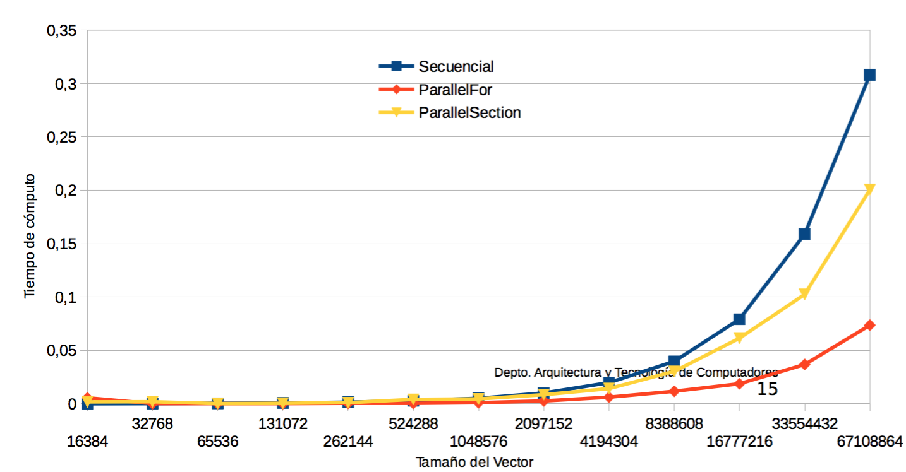

Arquitectura de Computadores
===================

Prácticas y seminarios de la asignatura Arquitectura de Computadores cursada en el Grado en Informática de la **Universidad de Granada**

----------

##Índice de Prácticas

### Práctica 0: Entorno de Programación 
En esta práctica se dejan varios ejemplos básicos de programas usando **OpenMP** que será la API para la programación multiproceso de memoria compartida que se usa en la asignatura.

> **Consideraciones:**

> - Los guiones de prácticas resueltos no los he subido, no obstante si surgiera alguna duda puedes ponerte en contacto conmigo a través de mi email.
> - Otro de los ejemplos que se deja SumaVectores.cpp para C++ y SumaVectores.c se usará en otras prácticas

<<<<<<< HEAD
### Práctica 1: Directivas con OpenMP

En esta práctica hacemos uso de las directivas que nos ofrece OpenMP para crear y terminar regiones paralelas, realizar tareas compartidas mediante sincronización y comunicación entre hilos.

> **Consideraciones:**
> 
> - Se hace especial hincapié en el uso de variables, funciones y directivas de OpenMP.
> - Debemos distinguir entre bloque estructurado, región y construcción.
> - Debemos distinguir entre directiva ejecutable y directiva declarativa.
> - El código en ASM ha sido generado con `gcc -S`.

### Práctica 2: Cláusulas OpenMP

En esta práctica hacemos uso de cláusulas fundamentales que ofrece OpenMP, con la que podremos tener control de la comunicación/sincronización y visibilidad de las variables.

> **Consideraciones:**
> 
> - Podremos discernir el ámbito de una variable en código.
> - Debemos hacer distinción entre directivas y cláusulas.
> - Entre los ejemplos se deja el producto de una matriz cuadrada M por un vector V implementado con OpenMP.
=======
| Nº de Componentes | Bytes de un Vector | T. Vectores Locales | T. Vectores Globales | T. Vectores Dinámicos |
|:-------------:|:-------------:|:-------------:|:-------------:|:-------------:|
| 65536  | 524288  | 0.000336244 | 0.000349606 | 0.000293322 |
| 131072 | 1048576 | 0.000622083 | 0.000632433 | 0.000537794 |
| 262144 | 2097152 | 0.001237088 | 0.001269812 | 0.001140235 |
| ... | ... | ... | ... | ... |
| 16777216 | 134217728 | - | 0.079689599 | 0.080892243 |
| 67108864 | 536870912 | - | 0.158487293 | 0.322524806 |  

#### Práctica 1: Directivas de OpenMP
En esta práctica se dejan varios programas con las directivas de **OpenMP** para ver el funcionamiento de cada una de las directivas. Dentro del código hay explicaciones en comentarios sobre cómo funcionan dichas directivas en la mayoría de programas.

Se deja a continuación una gráfica para observar como afecta en el tiempo de ejecución el uso de OpenMP respecto a un programa secuencial.

>>>>>>> origin/master
